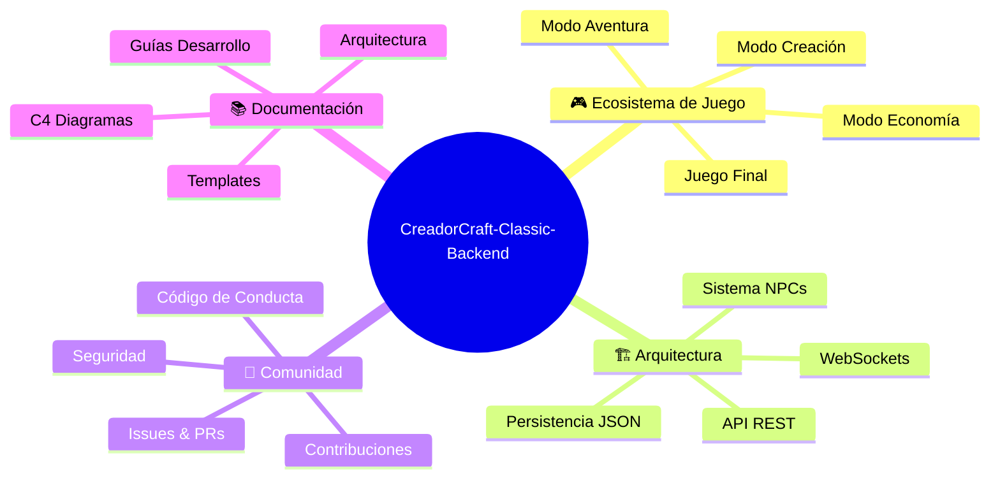

# 📚 Documentación de CreadorCraft-Classic-Backend

Bienvenido a la documentación completa de CreadorCraft-Classic-Backend. Esta página sirve como punto de entrada para toda la documentación del proyecto.

## 🗂️ Navegación Rápida

### 📋 **Documentación Principal**

| Documento | Descripción | 🔗 Enlace |
|-----------|-------------|-----------|
| **README.md** | Introducción general al proyecto, instalación y uso | [Ver README](../README.md) |
| **CONTRIBUTING.md** | Guía completa para contribuir al proyecto | [Ver Contributing](../CONTRIBUTING.md) |
| **CODE_OF_CONDUCT.md** | Código de conducta de la comunidad | [Ver Código de Conducta](../CODE_OF_CONDUCT.md) |
| **SECURITY.md** | Políticas de seguridad y reporte de vulnerabilidades | [Ver Seguridad](../SECURITY.md) |

### 🏗️ **Documentación de Arquitectura**

| Documento | Nivel | Descripción | 🔗 Enlace |
|-----------|--------|-------------|-----------|
| **Arquitectura General** | Visión Global | Principios, patrones y estructura completa | [Ver Arquitectura](architecture/README.md) |
| **Contexto del Sistema** | C4 - Nivel 1 | Actores externos y relaciones del sistema | [Ver C4-Context](c4-diagrams/01-context.md) |
| **Contenedores** | C4 - Nivel 2 | Servicios y comunicación entre componentes | [Ver C4-Containers](c4-diagrams/02-containers.md) |
| **Componentes** | C4 - Nivel 3 | Estructura interna del servidor de juego | [Ver C4-Components](c4-diagrams/03-components.md) |
| **Código** | C4 - Nivel 4 | Clases principales y relaciones de código | [Ver C4-Code](c4-diagrams/04-code.md) |

### 🛠️ **Templates y Configuraciones**

| Template | Propósito | 🔗 Enlace |
|-----------|-----------|-----------|
| **Pull Request Template** | Plantilla para PRs | [Ver Template](../.github/pull_request_template.md) |
| **Bug Report** | Reporte de errores estructurado | [Ver Template](../.github/ISSUE_TEMPLATE/reporte_bug.yml) |
| **Feature Request** | Solicitud de nuevas características | [Ver Template](../.github/ISSUE_TEMPLATE/solicitar_funcionalidad.yml) |
| **User Story** | Creación de historias de usuario con INVEST | [Ver Template](../.github/ISSUE_TEMPLATE/crear_US.yml) |
| **Dependabot Config** | Configuración de actualizaciones automáticas | [Ver Config](../.github/dependabot.yml) |

## 🎯 Rutas de Lectura Recomendadas

### 🆕 **Para Nuevos Colaboradores**
1. 📖 [README.md](../README.md) - Comprende qué es el proyecto
2. 🤝 [CONTRIBUTING.md](../CONTRIBUTING.md) - Aprende cómo contribuir
3. 📋 [CODE_OF_CONDUCT.md](../CODE_OF_CONDUCT.md) - Conoce las reglas de la comunidad
4. 🏗️ [Arquitectura General](architecture/README.md) - Entiende la estructura del sistema

### 🔧 **Para Desarrolladores**
1. 🏗️ [Arquitectura General](architecture/README.md) - Principios y patrones
2. 🌐 [C4-Context](c4-diagrams/01-context.md) - Visión del sistema completo
3. 🏢 [C4-Containers](c4-diagrams/02-containers.md) - Servicios y comunicación
4. ⚙️ [C4-Components](c4-diagrams/03-components.md) - Estructura interna
5. 💻 [C4-Code](c4-diagrams/04-code.md) - Clases y implementación

### 🏛️ **Para Arquitectos**
1. 🏗️ [Arquitectura General](architecture/README.md) - Decisiones arquitectónicas
2. 🌐 [C4-Context](c4-diagrams/01-context.md) - Límites del sistema
3. 🏢 [C4-Containers](c4-diagrams/02-containers.md) - Distribución de responsabilidades
4. ⚙️ [C4-Components](c4-diagrams/03-components.md) - Descomposición interna

### 👑 **Para Product Owners**
1. 📖 [README.md](../README.md) - Visión del producto
2. 🎯 [User Story Template](../.github/ISSUE_TEMPLATE/crear_US.yml) - Cómo crear historias
3. ✨ [Feature Request Template](../.github/ISSUE_TEMPLATE/solicitar_funcionalidad.yml) - Solicitar características
4. 🏗️ [Arquitectura General](architecture/README.md) - Capacidades técnicas

## 📊 Mapa Conceptual del Proyecto

## 🚀 Flujo de Desarrollo

### 📝 **Crear Nueva Funcionalidad**
1. 🎯 [Crear User Story](../.github/ISSUE_TEMPLATE/crear_US.yml) con criterios INVEST
2. 💬 Discutir en el issue creado
3. 🔧 Desarrollar siguiendo [CONTRIBUTING.md](../CONTRIBUTING.md)
4. 📋 Usar [PR Template](../.github/pull_request_template.md) para el Pull Request
5. ✅ Review y merge siguiendo GitLab Flow

### 🐛 **Reportar Bug**
1. 🔍 Buscar en issues existentes
2. 🐛 Usar [Bug Report Template](../.github/ISSUE_TEMPLATE/reporte_bug.yml)
3. 📋 Proporcionar información detallada
4. 🤝 Colaborar en la resolución

### ✨ **Solicitar Feature**
1. ✨ Usar [Feature Request Template](../.github/ISSUE_TEMPLATE/solicitar_funcionalidad.yml)
2. 💭 Describir problema y solución
3. 🎯 Proporcionar casos de uso
4. 📊 Esperar evaluación del equipo

## 🔧 Herramientas de Desarrollo

### **Configuración Automática**
- 🤖 **Dependabot**: Actualizaciones automáticas de dependencias
- 🔄 **GitHub Actions**: CI/CD con CreadorCraft-Maker
- 📋 **Templates**: Formularios estructurados para issues y PRs

### **Estándares de Calidad**
- ✅ **Code Review**: Obligatorio para todos los PRs
- 🧪 **Testing**: Framework básico (en desarrollo)
- 📏 **Linting**: ESLint recomendado
- 🎨 **Formatting**: Prettier recomendado

## 📞 Contacto y Soporte

### **Canales de Comunicación**
- 🐛 **Bugs**: [Crear Bug Report](https://github.com/Creadores-Program/CreadorCraft-Classic-Backend/issues/new?template=reporte_bug.yml)
- ✨ **Features**: [Crear Feature Request](https://github.com/Creadores-Program/CreadorCraft-Classic-Backend/issues/new?template=solicitar_funcionalidad.yml)
- 💬 **Discusiones**: [GitHub Discussions](https://github.com/Creadores-Program/CreadorCraft-Classic-Backend/discussions)
- 🔒 **Seguridad**: [Política de Seguridad](../SECURITY.md)

### **Recursos Adicionales**
- 🏢 **Organización**: [Creadores-Program](https://github.com/Creadores-Program)
- 📚 **Código**: [Repositorio Principal](https://github.com/Creadores-Program/CreadorCraft-Classic-Backend)
- 📋 **Issues**: [Lista de Issues](https://github.com/Creadores-Program/CreadorCraft-Classic-Backend/issues)
- 🔄 **Pull Requests**: [PRs Activos](https://github.com/Creadores-Program/CreadorCraft-Classic-Backend/pulls)

---

## 🎮 Sobre el Proyecto

CreadorCraft-Classic-Backend es una plataforma de juego híbrida y multijugador que une diferentes modalidades de juego en un solo ecosistema interconectado. Los jugadores pueden participar en distintas experiencias que se complementan entre sí, donde la progresión en una modalidad puede influir o ser necesaria para el progreso en otra.

**Características Clave:**
- 🌐 **API RESTful** para comunicación principal
- ⚡ **WebSockets** para sincronización en tiempo real  
- 🤖 **Sistema NPC** para continuidad cuando no hay jugadores
- 🎯 **Ecosistema Unificado** con múltiples modos interconectados
- 💾 **Persistencia Robusta** con auto-save cada 10 minutos

---

*Esta documentación es un documento vivo que evoluciona con el proyecto. ¡Las contribuciones para mejorarla son siempre bienvenidas!*

**Última actualización**: Enero 2024  
**Versión de la documentación**: 1.0  
**Mantenido por**: [Creadores-Program](https://github.com/Creadores-Program)