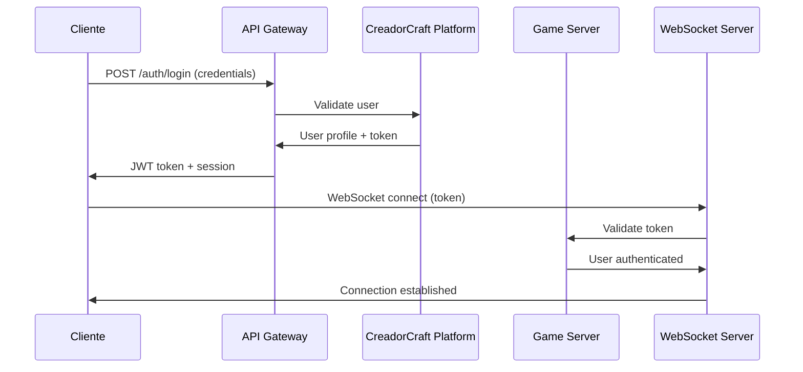
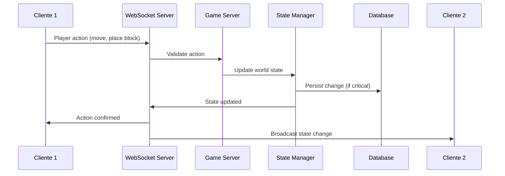
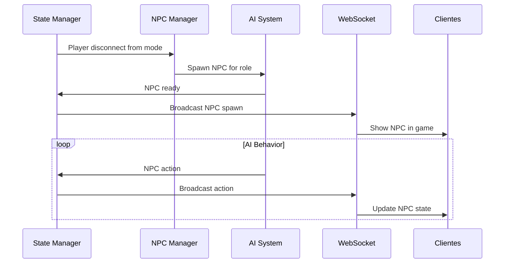

# Arquitectura de CreadorCraft-Classic-Backend

## 🏗️ Visión General de la Arquitectura

CreadorCraft-Classic-Backend es una plataforma de juego híbrida y multijugador construida con Node.js que implementa un ecosistema de juego interconectado donde diferentes modalidades se complementan entre sí.

### 📋 Tabla de Contenidos

1. [Principios Arquitectónicos](#principios-arquitectónicos)
2. [Patrones de Diseño](#patrones-de-diseño)  
3. [Componentes del Sistema](#componentes-del-sistema)
4. [Flujos de Datos](#flujos-de-datos)
5. [Tecnologías y Stack](#tecnologías-y-stack)
6. [Escalabilidad](#escalabilidad)
7. [Seguridad](#seguridad)
8. [Monitoreo y Observabilidad](#monitoreo-y-observabilidad)

## 🎯 Principios Arquitectónicos

### 1. **Ecosistema Unificado**
- **Principio**: Todos los modos de juego están interconectados
- **Implementación**: Progresión compartida, recursos transferibles entre modos
- **Beneficio**: Experiencia cohesiva que incentiva participación en todos los modos

### 2. **Tolerancia a Fallos con NPCs**
- **Principio**: El sistema debe funcionar incluso sin jugadores humanos
- **Implementación**: Sistema inteligente de NPCs que reemplaza jugadores ausentes
- **Beneficio**: Disponibilidad continua del ecosistema

### 3. **Comunicación Híbrida**
- **Principio**: API REST para configuración, WebSockets para tiempo real
- **Implementación**: Separación clara de responsabilidades de comunicación
- **Beneficio**: Eficiencia y flexibilidad en diferentes casos de uso

### 4. **Persistencia Robusta**
- **Principio**: Auto-save frecuente y recuperación de desastres
- **Implementación**: Guardado automático cada 10 minutos + eventos críticos
- **Beneficio**: Minimizar pérdida de progreso

### 5. **Modularidad y Extensibilidad**
- **Principio**: Componentes independientes y bien definidos
- **Implementación**: Separación por responsabilidades, interfaces claras
- **Beneficio**: Fácil mantenimiento y adición de nuevas funcionalidades

## 🎨 Patrones de Diseño

### **Patrón Factory**
```javascript
// Creación de entidades por tipo
class EntityFactory {
    static createEntity(type, x, y, world, vid) {
        const entities = {
            'player': () => new Player(x, y, world, vid),
            'zombie': () => new Zombie(x, y, world, vid),
            'npc_trader': () => new NPCTrader(x, y, world, vid)
        };
        return entities[type] ? entities[type]() : null;
    }
}
```

**Uso en el proyecto:**
- `Generador.convertEntityById()` - Crear entidades por ID
- `Biome.getBiomeById()` - Crear biomas específicos  
- `Block.createBlockById()` - Instanciar tipos de bloques

### **Patrón Strategy**
```javascript
// Diferentes estrategias de IA por tipo de entidad
class AIBehavior {
    execute(entity) { /* Implementar en subclases */ }
}

class PassiveAI extends AIBehavior {
    execute(entity) {
        // Comportamiento pasivo: deambular aleatoriamente
    }
}

class AggressiveAI extends AIBehavior {
    execute(entity) {
        // Comportamiento agresivo: atacar jugadores cercanos
    }
}
```

**Uso en el proyecto:**
- Comportamientos de IA para diferentes tipos de entidades
- Estrategias de generación de terreno por bioma
- Algoritmos de balanceo económico

### **Patrón Observer (Event-Driven)**
```javascript
class GameEventSystem extends EventEmitter {
    // Emit eventos de juego
    playerMoved(playerId, from, to) {
        this.emit('player:moved', { playerId, from, to });
    }
    
    blockPlaced(playerId, block, position) {
        this.emit('block:placed', { playerId, block, position });
    }
}

// Componentes se suscriben a eventos
gameEvents.on('player:moved', (data) => {
    // Actualizar estado, validar posición, broadcast a otros jugadores
});
```

**Uso en el proyecto:**
- Sistema de eventos para comunicación entre componentes
- Notificaciones en tiempo real a clientes WebSocket
- Triggers para auto-save y logging

### **Patrón Singleton**
```javascript
class GameStateManager {
    constructor() {
        if (GameStateManager.instance) {
            return GameStateManager.instance;
        }
        this.worlds = new Map();
        this.players = new Map();
        GameStateManager.instance = this;
    }
    
    static getInstance() {
        return new GameStateManager();
    }
}
```

**Uso en el proyecto:**
- Gestor global de estado de juego
- Configuración del servidor
- Pool de conexiones WebSocket

## 🏢 Componentes del Sistema

### **Capa de Presentación**
```
┌─────────────────────────────────────┐
│           Cliente Web/Juego          │
│  - Renderizado                      │  
│  - Input de usuario                 │
│  - WebSocket client                 │
└─────────────────────────────────────┘
```

### **Capa de API**
```
┌─────────────────────────────────────┐
│            API Gateway              │
│  - Autenticación                   │
│  - Rate limiting                   │  
│  - Request validation              │
│  - Response formatting            │
└─────────────────────────────────────┘
```

### **Capa de Lógica de Negocio**
```
┌─────────────────────────────────────┐
│       Servidor de Juego Principal    │
│  - Orquestación de modos           │
│  - Validación de reglas            │
│  - Coordinación de sistemas        │
└─────────────────────────────────────┘

┌──────────────┬──────────────┬────────────────┐
│   Gestor de  │   Sistema    │   Motor de     │
│   Estado     │   NPC        │   Economía     │
│              │              │                │
│  - Mundos    │  - IA        │  - Inventarios │
│  - Entidades │  - Spawning  │  - Comercio    │
│  - Sincroniz.│  - Comportam.│  - Balanceo    │
└──────────────┴──────────────┴────────────────┘
```

### **Capa de Comunicación**
```
┌─────────────────────────────────────┐
│      Comunicación en Tiempo Real     │
│  - WebSocket server                 │
│  - Event broadcasting              │
│  - Connection management           │
└─────────────────────────────────────┘
```

### **Capa de Persistencia**
```
┌─────────────────────────────────────┐
│        Base de Datos del Juego       │
│  - JSON file storage               │
│  - Auto-save system               │
│  - Backup & recovery              │
└─────────────────────────────────────┘
```

## 🔄 Flujos de Datos

### **Flujo de Autenticación y Conexión**



### **Flujo de Acción en Tiempo Real**



### **Flujo de Gestión de NPCs**



## 💻 Tecnologías y Stack

### **Backend Core**
- **Node.js**: Runtime de JavaScript del lado servidor
- **Express.js**: Framework web para API REST (planeado)
- **WebSockets**: Comunicación en tiempo real
- **EventEmitter**: Sistema de eventos interno

### **Persistencia**
- **JSON File Storage**: Almacenamiento local de datos
- **LocalStorage API**: Persistencia en cliente (actual)
- **File System API**: Acceso a archivos del sistema

### **Desarrollo y Testing**
- **JavaScript ES6+**: Lenguaje principal
- **CommonJS**: Sistema de módulos
- **GitHub Actions**: CI/CD pipeline
- **CreadorCraft-Maker**: Herramienta de build específica

### **Herramientas de Desarrollo**
```json
{
  "build": "CreadorCraft-Maker-GHA",
  "testing": "Framework básico (a definir)",
  "linting": "ESLint (recomendado)",
  "formatting": "Prettier (recomendado)"
}
```

## ⚡ Escalabilidad

### **Escalabilidad Horizontal**

#### **Arquitectura Multi-Instancia**
```
┌─────────────┐    ┌─────────────┐    ┌─────────────┐
│   Game      │    │   Game      │    │   Game      │
│ Server #1   │    │ Server #2   │    │ Server #3   │
│             │    │             │    │             │
│ Mundos 1-10 │    │Mundos 11-20 │    │Mundos 21-30 │
└─────────────┘    └─────────────┘    └─────────────┘
       │                   │                   │
       └─────────────────────┴─────────────────────┘
                          │
                ┌─────────────────┐
                │  Load Balancer  │
                │   API Gateway   │  
                └─────────────────┘
```

#### **Sharding de Mundos**
- **Por ID de Mundo**: Mundos distribuidos entre instancias
- **Por Región Geográfica**: Servidores cercanos a usuarios
- **Por Tipo de Modo**: Servidores especializados por modo de juego

### **Escalabilidad Vertical**

#### **Optimizaciones de Memoria**
```javascript
class WorldCache {
    constructor(maxSize = 1000) {
        this.cache = new Map();
        this.maxSize = maxSize;
    }
    
    get(worldId) {
        // LRU cache implementation
        if (this.cache.has(worldId)) {
            const world = this.cache.get(worldId);
            this.cache.delete(worldId);
            this.cache.set(worldId, world); // Move to end
            return world;
        }
    }
    
    set(worldId, world) {
        if (this.cache.size >= this.maxSize) {
            const firstKey = this.cache.keys().next().value;
            this.cache.delete(firstKey);
        }
        this.cache.set(worldId, world);
    }
}
```

#### **Optimizaciones de CPU**
- **Event Loop**: Uso eficiente con operaciones asíncronas
- **Clustering**: Worker processes para tareas CPU-intensivas
- **Streaming**: Procesamiento de datos grandes en chunks

### **Métricas de Rendimiento**

| Métrica | Objetivo | Actual | Estrategia |
|---------|----------|--------|------------|
| **Jugadores Concurrentes** | 1000+ | 100+ | Horizontal scaling |
| **Latencia WebSocket** | <50ms | <100ms | Optimización de red |
| **Throughput API** | 10k req/min | 1k req/min | Caching + CDN |
| **Memoria por Mundo** | <100MB | ~50MB | Compresión datos |
| **Tiempo de Carga** | <2s | ~5s | Lazy loading |

## 🔒 Seguridad

### **Autenticación y Autorización**

#### **JWT Token Flow**
```javascript
class AuthService {
    generateToken(user) {
        const payload = {
            userId: user.id,
            username: user.username,
            permissions: user.permissions,
            exp: Math.floor(Date.now() / 1000) + (60 * 60 * 24) // 24h
        };
        return jwt.sign(payload, process.env.JWT_SECRET);
    }
    
    validateToken(token) {
        try {
            return jwt.verify(token, process.env.JWT_SECRET);
        } catch (error) {
            throw new Error('Invalid token');
        }
    }
}
```

#### **Roles y Permisos**
```javascript
const PERMISSIONS = {
    PLAYER: ['play', 'build', 'trade'],
    MODERATOR: ['play', 'build', 'trade', 'kick', 'ban'],
    ADMIN: ['*'] // All permissions
};

class PermissionChecker {
    hasPermission(user, action) {
        const userPermissions = PERMISSIONS[user.role] || [];
        return userPermissions.includes('*') || userPermissions.includes(action);
    }
}
```

### **Validación de Entrada**

#### **Sanitización de Datos**
```javascript
class InputValidator {
    sanitizePlayerAction(action) {
        // Validate movement bounds
        if (action.type === 'move') {
            action.x = Math.max(-1000, Math.min(1000, Number(action.x)));
            action.y = Math.max(-1000, Math.min(1000, Number(action.y)));
        }
        
        // Validate block placement
        if (action.type === 'place_block') {
            if (!this.isValidBlockType(action.blockType)) {
                throw new Error('Invalid block type');
            }
        }
        
        return action;
    }
}
```

#### **Rate Limiting**
```javascript
class RateLimiter {
    constructor() {
        this.limits = new Map();
    }
    
    checkLimit(userId, action, maxPerMinute = 60) {
        const key = `${userId}:${action}`;
        const now = Date.now();
        const windowStart = now - 60000; // 1 minute window
        
        if (!this.limits.has(key)) {
            this.limits.set(key, []);
        }
        
        const requests = this.limits.get(key);
        const recentRequests = requests.filter(time => time > windowStart);
        
        if (recentRequests.length >= maxPerMinute) {
            throw new Error('Rate limit exceeded');
        }
        
        recentRequests.push(now);
        this.limits.set(key, recentRequests);
    }
}
```

### **Prevención de Exploits**

#### **Anti-Cheat Básico**
```javascript
class AntiCheat {
    validatePlayerMovement(playerId, from, to, timeElapsed) {
        const distance = this.calculateDistance(from, to);
        const maxSpeed = 10; // blocks per second
        const expectedMaxDistance = maxSpeed * (timeElapsed / 1000);
        
        if (distance > expectedMaxDistance * 1.5) { // 50% tolerance
            this.flagSuspiciousActivity(playerId, 'speed_hack');
            return false;
        }
        
        return true;
    }
    
    validateInventoryChange(playerId, itemId, count) {
        const player = this.getPlayer(playerId);
        const currentCount = player.inventory[itemId] || 0;
        
        if (count > currentCount + 64) { // Max possible gain per action
            this.flagSuspiciousActivity(playerId, 'item_duplication');
            return false;
        }
        
        return true;
    }
}
```

## 📊 Monitoreo y Observabilidad

### **Métricas de Sistema**

#### **Health Checks**
```javascript
class HealthMonitor {
    async checkSystemHealth() {
        return {
            timestamp: new Date(),
            status: 'healthy',
            metrics: {
                activeConnections: this.getActiveConnections(),
                memoryUsage: process.memoryUsage(),
                cpuUsage: await this.getCPUUsage(),
                activeWorlds: this.getActiveWorldCount(),
                totalPlayers: this.getTotalPlayerCount()
            }
        };
    }
}
```

#### **Performance Metrics**
```javascript
class MetricsCollector {
    trackPlayerAction(action, duration) {
        this.metrics.push({
            type: 'player_action',
            action: action.type,
            duration,
            timestamp: Date.now()
        });
    }
    
    trackWebSocketMessage(messageType, size) {
        this.metrics.push({
            type: 'websocket_message',
            messageType,
            size,
            timestamp: Date.now()
        });
    }
}
```

### **Logging Estructurado**

#### **Log Levels y Contexto**
```javascript
class Logger {
    info(message, context = {}) {
        console.log(JSON.stringify({
            level: 'INFO',
            timestamp: new Date().toISOString(),
            message,
            ...context
        }));
    }
    
    error(message, error, context = {}) {
        console.error(JSON.stringify({
            level: 'ERROR',
            timestamp: new Date().toISOString(),
            message,
            error: error.stack,
            ...context
        }));
    }
}
```

### **Alertas y Notificaciones**

#### **Thresholds de Alerta**
```javascript
const ALERT_THRESHOLDS = {
    HIGH_MEMORY_USAGE: 0.8,        // 80% de RAM
    HIGH_CPU_USAGE: 0.7,           // 70% de CPU
    LOW_DISK_SPACE: 0.9,           // 90% de disco usado
    HIGH_ERROR_RATE: 0.05,         // 5% de requests con error
    SLOW_RESPONSE_TIME: 1000       // 1 segundo
};

class AlertManager {
    checkThresholds(metrics) {
        if (metrics.memoryUsage > ALERT_THRESHOLDS.HIGH_MEMORY_USAGE) {
            this.sendAlert('High memory usage detected', metrics);
        }
        // ... más checks
    }
}
```

---

## 🚀 Roadmap Arquitectónico

### **Fase 1: Estabilización (Actual)**
- ✅ Sistema básico de mundos y entidades
- ✅ Persistencia con JSON
- ✅ Auto-save cada 10 minutos
- 🔄 **En desarrollo**: Documentación completa

### **Fase 2: Comunicación (Q2 2024)**
- 📋 **Planeado**: WebSocket server robusto
- 📋 **Planeado**: API REST completa
- 📋 **Planeado**: Sistema de autenticación

### **Fase 3: Inteligencia (Q3 2024)**
- 📋 **Planeado**: Sistema NPC completo
- 📋 **Planeado**: IA básica para NPCs
- 📋 **Planeado**: Motor de economía

### **Fase 4: Escalabilidad (Q4 2024)**
- 📋 **Planeado**: Arquitectura multi-instancia
- 📋 **Planeado**: Base de datos distribuida
- 📋 **Planeado**: Monitoreo avanzado

---

*Esta arquitectura está diseñada para ser evolutiva, permitiendo crecimiento incremental mientras mantiene la estabilidad del sistema actual.*