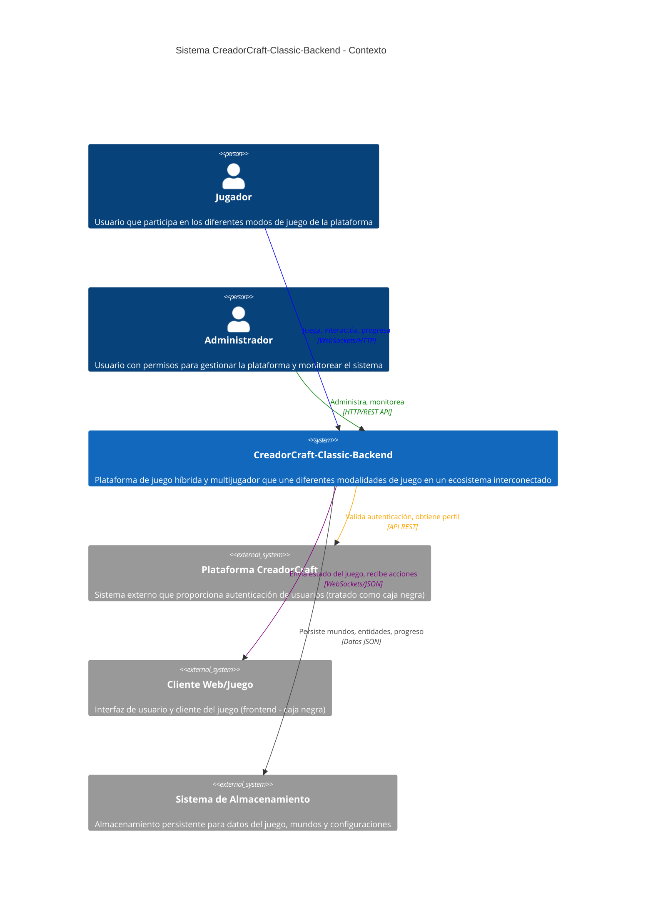

# Diagrama C4 - Nivel 1: Contexto del Sistema

## CreadorCraft-Classic-Backend - Contexto del Sistema

Este diagrama muestra el contexto general del sistema CreadorCraft-Classic-Backend y cómo interactúa con usuarios externos y otros sistemas.

## Descripción del Contexto

### Actores Principales

#### 👥 **Jugadores**
- **Rol**: Usuarios finales que participan en la experiencia de juego
- **Actividades**:
  - Participan en diferentes modos de juego (aventura, tienda/economía, creación de niveles)
  - Interactúan en tiempo real con otros jugadores
  - Progresan a través del ecosistema interconectado
  - Construyen, comercian y crean contenido

#### 👑 **Administradores**
- **Rol**: Usuarios con permisos especiales para gestión del sistema
- **Actividades**:
  - Monitorean el estado del sistema y métricas de uso
  - Gestionan configuraciones del servidor
  - Moderan contenido y comportamiento de usuarios
  - Realizan mantenimiento y actualizaciones

### Sistemas Externos

#### 🔗 **Plataforma CreadorCraft**
- **Naturaleza**: Sistema externo (caja negra)
- **Propósito**: Proporciona servicios de autenticación y gestión de usuarios
- **Interacciones**:
  - Validación de credenciales de usuario
  - Obtención de perfiles y permisos
  - Sincronización de estado de cuenta

#### 🎮 **Cliente Web/Juego**
- **Naturaleza**: Frontend (caja negra, implementación futura)
- **Propósito**: Interfaz de usuario y renderizado del juego
- **Interacciones**:
  - Recibe actualizaciones de estado en tiempo real via WebSockets
  - Envía acciones del jugador al backend
  - Renderiza elementos del juego (bloques, entidades, UI)

#### 💾 **Sistema de Almacenamiento**
- **Naturaleza**: Capa de persistencia
- **Propósito**: Almacenamiento persistente de datos del juego
- **Datos Gestionados**:
  - Mundos generados y modificados por jugadores
  - Estado de entidades y NPCs
  - Progreso y configuraciones de jugadores
  - Datos de economía e inventarios

### Flujos de Comunicación

#### 🔄 **Comunicación en Tiempo Real**
- **Protocolo**: WebSockets con mensajes JSON
- **Propósito**: Sincronización inmediata de estado entre jugadores
- **Datos**: Posiciones, acciones, eventos, cambios de mundo

#### 🌐 **API REST**
- **Propósito**: Operaciones de configuración y gestión
- **Casos de Uso**: Autenticación, configuración, administración, métricas

#### 💿 **Persistencia**
- **Formato**: JSON para compatibilidad y flexibilidad
- **Frecuencia**: Automática cada 10 minutos y en eventos críticos
- **Alcance**: Mundos completos, estado de jugadores, configuraciones

### Características Clave del Sistema

#### 🎯 **Ecosistema Unificado**
El sistema no es solo un juego, sino una plataforma que conecta múltiples experiencias:
- Cada modo de juego influye en los otros
- La progresión es compartida entre modalidades
- El "juego final" requiere logros de todos los modos

#### 🤖 **Sistema NPC Inteligente**
Cuando no hay jugadores humanos disponibles:
- NPCs automáticamente toman roles necesarios
- Garantizan que el ecosistema siga funcionando
- Mantienen la economía y experiencias activas

#### ⚡ **Escalabilidad y Rendimiento**
- WebSockets para comunicación de baja latencia
- Arquitectura preparada para múltiples jugadores concurrentes
- Sistema de save automático para prevenir pérdida de progreso

---

## Tecnologías de Comunicación

| Protocolo | Uso | Características |
|-----------|-----|-----------------|
| **WebSockets** | Tiempo real | Baja latencia, bidireccional, JSON |
| **HTTP/REST** | Configuración | Operaciones CRUD, autenticación |
| **JSON** | Datos | Intercambio y persistencia |

---

*Este diagrama representa el nivel más alto de abstracción del sistema, mostrando cómo CreadorCraft-Classic-Backend se integra en el ecosistema más amplio de la plataforma CreadorCraft.*