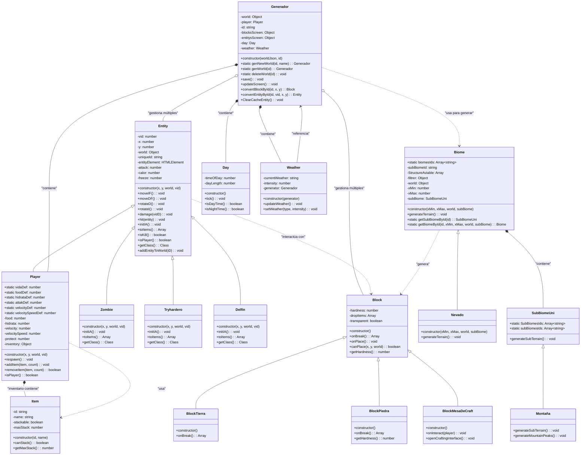

# Diagrama C4 - Nivel 4: Código

## CreadorCraft-Classic-Backend - Estructura de Código

Este diagrama muestra las clases principales y sus relaciones dentro del componente "Sistema de Entidades" del servidor de juego.



## Descripción de Clases Principales

### 🏗️ **Clase Entity (Clase Base)**
```javascript
class Entity {
    constructor(x, y, world, vid) {
        this.vid = vid;                    // Vida de la entidad
        this.x = x;                        // Posición X
        this.y = y;                        // Posición Y
        this.world = world;                // Referencia al mundo
        this.uniqueId = -1;                // ID único para tracking
        this.entityElement = document.createElement("div");
        this.entityElement.classList.add("Entity");
    }
    
    // Métodos de movimiento
    moveIF() { /* Mover izquierda */ }
    moveDF() { /* Mover derecha */ }
    rotateD() { /* Rotar derecha */ }
    rotateI() { /* Rotar izquierda */ }
    
    // Sistema de combate
    damage(vidD) {
        this.vid -= vidD;
        if (this.vid <= 0) {
            this.kill();
        }
    }
    
    hit(entity) {
        entity.damage(this.attak);
        if (entity.isKill() && entity.isPlayer()) {
            $("#killScreen").fadeIn();
        } else if (entity.isKill() && this.isPlayer()) {
            for (var i of entity.toItems()) {
                this.addItem(i, -1);
            }
        }
    }
    
    // Métodos abstractos/virtuales
    initIA() { /* Implementar en subclases */ }
    toItems() { return []; }
    isPlayer() { return false; }
    isKill() { 
        return this.world.entitys[this.x] == null || 
               this.world.entitys[this.x][this.y] == null; 
    }
}
```

### 👤 **Clase Player (Entidad Controlable)**
```javascript
class Player extends Entity {
    // Constantes estáticas para valores por defecto
    static vidaDef = 100;
    static foodDef = 100;
    static hidrataDef = 100;
    static attakDef = 10;
    
    constructor(x, y, world, vid) {
        super(x, y, world, vid);
        this.food = Player.foodDef;
        this.hidrata = Player.hidrataDef;
        this.inventary = {};
        this.velocity = Player.velocityDef;
        this.velocitySpeed = Player.velocitySpeedDef;
    }
    
    isPlayer() { return true; }
    
    respawn() {
        this.x = this.world.spawnPos[0];
        this.y = this.world.spawnPos[1];
        this.vid = Player.vidaDef;
        this.food = Player.foodDef;
        this.hidrata = Player.hidrataDef;
    }
    
    addItem(item, count) {
        if (this.inventary[item.id]) {
            this.inventary[item.id] += count;
        } else {
            this.inventary[item.id] = count;
        }
    }
}
```

### 🧟 **Clases de Entidades Hostiles**
```javascript
class Zombie extends Entity {
    initIA() {
        // IA básica: perseguir al jugador más cercano
        setInterval(() => {
            const nearestPlayer = this.findNearestPlayer();
            if (nearestPlayer && this.distanceTo(nearestPlayer) < 10) {
                this.moveTowards(nearestPlayer);
            }
        }, 1000);
    }
    
    toItems() {
        return ["rotten_flesh", "bone"];
    }
}

class Tryhardero extends Entity {
    initIA() {
        // IA más agresiva que zombie
        setInterval(() => {
            const nearestPlayer = this.findNearestPlayer();
            if (nearestPlayer && this.distanceTo(nearestPlayer) < 15) {
                this.moveTowards(nearestPlayer);
                if (this.distanceTo(nearestPlayer) <= 1) {
                    this.hit(nearestPlayer);
                }
            }
        }, 500); // Más rápido que zombie
    }
}
```

### 🌍 **Clase Generador (Gestor de Mundo)**
```javascript
class Generador {
    constructor(worldJson, id) {
        this.world = worldJson;
        this.player = new Player(
            this.world.player.coords[0], 
            this.world.player.coords[1], 
            this.world, 
            this.world.player.vida
        );
        this.id = id;
        
        // Auto-save cada 10 minutos
        setInterval(this.save.bind(this), 600000);
        
        // Inicializar sistemas ambientales
        this.day = new Day();
        this.weather = new Weather(this);
    }
    
    static genNewWorld(id, name) {
        let worldCache = {
            player: {
                coords: [0.0, 0.0],
                vida: Player.vidaDef,
                food: Player.foodDef,
                hidrata: Player.hidrataDef,
                inventary: {}
            },
            entitys: {},
            blocks: {},
            spawnPos: [0.0, 0.0],
            biomes: {}
        };
        
        // Registrar mundo en datos globales
        let dataG = JSON.parse(GameProps.getStorage().get("data"));
        dataG.worlds.push({ id: id, name: name });
        GameProps.getStorage().set("data", JSON.stringify(dataG));
        GameProps.getStorage().set(id, JSON.stringify(worldCache));
        
        return new Generador(worldCache, id);
    }
    
    convertEntityById(id, vid, x, y) {
        switch(id) {
            case "player": return new Player(x, y, this.world, vid);
            case "zombie": return new Zombie(x, y, this.world, vid);
            case "tryhardero": return new Tryhardero(x, y, this.world, vid);
            case "delfin": return new Delfin(x, y, this.world, vid);
            default: return new Entity(x, y, this.world, vid);
        }
    }
}
```

### 🧱 **Sistema de Bloques**
```javascript
class Block {
    constructor() {
        this.hardness = 1;
        this.dropItems = [];
        this.transparent = false;
    }
    
    onBreak() { return this.dropItems; }
    onPlace() { /* Lógica de colocación */ }
    canPlace(x, y, world) { return true; }
}

class BlockMesaDeCraft extends Block {
    constructor() {
        super();
        this.hardness = 2;
    }
    
    onInteract(player) {
        this.openCraftingInterface(player);
    }
    
    openCraftingInterface(player) {
        // Abrir UI de crafting
        $("#craftingInterface").show();
    }
}
```

### 🏔️ **Sistema de Biomas**
```javascript
class Biome {
    static biomesIds = ["nevado", "normal", "desierto", "oceano", "FortalezaFin"];
    
    constructor(xMin, xMax, world, subBiome) {
        this.world = world;
        this.xMin = xMin;
        this.xMax = xMax;
        this.subBiomeId = subBiome || SubBiomeUni.SubBiomesIds[
            Math.floor(Math.random() * SubBiomeUni.SubBiomesIds.length)
        ];
        this.subBiome = Biome.getSubBiomeById(this.subBiomeId);
    }
    
    static getBiomeById(id, xMin, xMax, world, subBiome) {
        switch(id) {
            case "nevado": return new Nevado(xMin, xMax, world, subBiome);
            case "normal": return new Normal(xMin, xMax, world, subBiome);
            default: return new Biome(xMin, xMax, world, subBiome);
        }
    }
}

class Nevado extends Biome {
    generateTerrain() {
        // Generar terreno nevado con bloques de hielo y nieve
        for (let x = this.xMin; x < this.xMax; x++) {
            this.generateSnowColumn(x);
        }
    }
    
    generateSnowColumn(x) {
        // Lógica específica para columnas de nieve
        const height = this.calculateSnowHeight(x);
        for (let y = 0; y < height; y++) {
            this.world.blocks[x] = this.world.blocks[x] || {};
            this.world.blocks[x][y] = "snow_block";
        }
    }
}
```

## Patrones de Diseño en Código

### 🏭 **Factory Method Pattern**
```javascript
// En Generador
convertEntityById(id, vid, x, y) {
    const entityFactories = {
        'player': () => new Player(x, y, this.world, vid),
        'zombie': () => new Zombie(x, y, this.world, vid),
        'tryhardero': () => new Tryhardero(x, y, this.world, vid)
    };
    
    const factory = entityFactories[id];
    return factory ? factory() : new Entity(x, y, this.world, vid);
}
```

### 🎯 **Strategy Pattern**
```javascript
// Sistema de IA por tipo de entidad
class AIStrategy {
    execute(entity) { /* Implementar en subclases */ }
}

class ZombieAI extends AIStrategy {
    execute(entity) {
        // Comportamiento de zombie: lento, persigue jugadores
    }
}

class TryharderoAI extends AIStrategy {
    execute(entity) {
        // Comportamiento más agresivo y rápido
    }
}
```

### 📡 **Observer Pattern**
```javascript
// Sistema de eventos para comunicación entre componentes
class GameEventEmitter extends EventEmitter {
    emitEntityDamage(entity, damage) {
        this.emit('entity:damage', { entity, damage });
    }
    
    emitBlockPlaced(block, position) {
        this.emit('block:placed', { block, position });
    }
}

// Los componentes se suscriben a eventos
gameEvents.on('entity:damage', (data) => {
    // Actualizar UI, efectos visuales, etc.
});
```

## Flujos de Ejecución de Código

### 🎮 **Flujo de Creación de Mundo**
1. `Generador.genNewWorld(id, name)` - Factory method estático
2. Crear estructura de datos `worldCache`
3. Persistir en storage: `GameProps.getStorage().set(id, JSON.stringify(worldCache))`
4. `new Generador(worldCache, id)` - Constructor
5. `new Player(coords, vida)` - Crear jugador inicial
6. `setInterval(this.save, 600000)` - Configurar auto-save
7. `new Day()` y `new Weather()` - Sistemas ambientales

### ⚔️ **Flujo de Combate Entre Entidades**
1. `entityA.hit(entityB)` - Iniciar ataque
2. `entityB.damage(entityA.attak)` - Aplicar daño
3. `entityB.vid -= damage` - Reducir vida
4. Si `entityB.vid <= 0`: `entityB.kill()` - Eliminar entidad
5. Si era player: `$("#killScreen").fadeIn()` - Mostrar pantalla de muerte
6. Si era mob y atacante player: `player.addItem(entityB.toItems())` - Drops

### 🌍 **Flujo de Generación de Terreno**
1. `Biome.getBiomeById(id, params)` - Factory para bioma
2. `biome.generateTerrain()` - Método polimórfico según tipo
3. Para cada columna X: `generateColumn(x)`
4. Calcular altura según algoritmo del bioma
5. `world.blocks[x][y] = blockType` - Colocar bloques
6. `subBiome.generateSubTerrain()` - Detalles específicos

### 💾 **Flujo de Guardado Automático**
1. Timer ejecuta cada 600000ms (10 minutos)
2. `this.save()` - Método de instancia
3. `JSON.stringify(this.world)` - Serializar estado actual
4. `GameProps.getStorage().set(this.id, worldData)` - Persistir
5. Actualizar timestamp de último guardado

---

*Este diagrama de código muestra la estructura interna detallada de las clases principales, sus relaciones y patrones de diseño utilizados para crear un sistema de juego modular y extensible.*